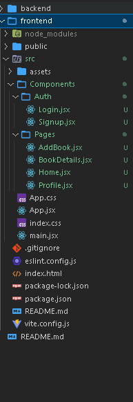
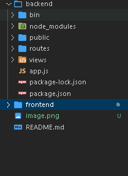

# Book Review Platform – MERN Stack Assignment (UI Phase)

[GitHub Repository](https://github.com/ravitharun/Book-Review-Platform.git)

---

## 📌 Project Overview

The **Book Review Platform** is a web application designed for users to explore books, read reviews, and manage their own book collection.  
This project is built using **React** for the frontend (UI phase) with a modular structure ready for backend integration.

> **Note:** This README reflects the current state of the project (UI phase). Backend and API integration will be added next.

---

## 🟢 Features (UI Phase)

### Authentication

- **Signup Page** – Form to register new users (Name, Email, Password)
- **Login Page** – Form to login users
- Navigation between login and signup pages

### Pages

- **Home Page** – Displays a list of books (static data for now) with pagination
- **Book Details Page** – Shows detailed information about a selected book and reviews (static for now)
- **Add/Edit Book Page** – Form to add new books or edit existing ones
- **Profile Page** – Displays user’s added books and reviews (static data)

### Components

- **Navbar** – Navigation links for Home, Login, Signup, Profile, and Add Book
- **BookCard** – Displays book info in a card layout
- **ReviewItem** – Shows individual review information
- **Pagination** – Handles page navigation
- **StarRating** – Displays and selects ratings
- **ProtectedRoute** – Restricts access to pages for logged-in users

---

## 📂 Frontend Structure Frontend

<image src="" >

## 📂 Frontend Structure Backend

<image src="" >

---

## 🛠️ Technologies Used

- **React** – Frontend library for building UI
- **React Router DOM** – For routing and navigation
- **Axios** – For future API integration
- **TailwindCSS / Bootstrap** – Styling and responsive design
- **React Toastify** – Notifications and alerts
- **React Icons** – Icons for buttons and navigation

---

## ⚡ Future Enhancements (Next Phase)

- Connect frontend with **Node.js + Express backend**
- Implement **MongoDB database** with schemas for User, Book, and Review
- Add **JWT authentication** and protected routes
- Enable **CRUD operations** for books and reviews
- Dynamic **average rating calculation** and **pagination from API**
- Bonus: Search, filter, sorting, dark/light mode, and charts

---

## 🗺️ UI-Only Roadmap (Current Phase)

| Phase          | Tasks Completed                                                              | Next Steps                           |
| -------------- | ---------------------------------------------------------------------------- | ------------------------------------ |
| Authentication | Signup & Login components created                                            | Connect to backend API               |
| Pages          | Home, BookDetails, AddBook, Profile pages created                            | Populate dynamic data from backend   |
| Components     | Navbar, BookCard, ReviewItem, StarRating, Pagination, ProtectedRoute created | Refine styling and responsive design |
| Styling        | TailwindCSS/Bootstrap integrated                                             | Add notifications & icons            |
| Routing        | React Router configured                                                      | Protect routes & handle redirects    |

> This roadmap helps track **what’s done** and **what remains** for full functionality.

---

## 📌 Contact

**Ravi Tharun**

- GitHub: [ravitharun](https://github.com/ravitharun)
- Email: tharunravi672@gmail.com
- Location: Bangalore, India
